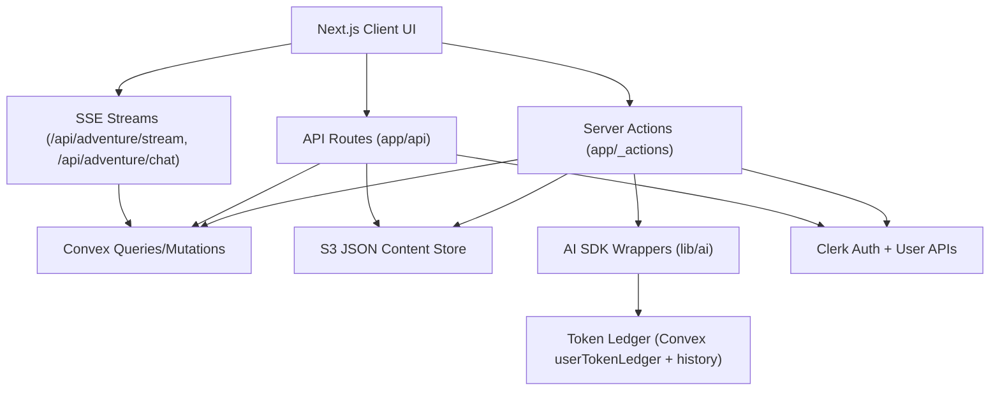

# TECHNICAL_DOCUMENTATION

Project: `d20adventures.com`  
Last Updated: 2026-02-28

## 1. Document Intent

This document is the canonical technical guide for both:

1. A human engineer onboarding to D20 Adventures.
2. An LLM agent that needs fast, high-fidelity project context.

It explains architecture, data flow, runtime behavior, external dependencies, key files, and practical operating procedures.

---

## 2. Project Summary

D20 Adventures is a narrative RPG platform where players interact with an AI-driven game master in turn-based encounters. The product combines:

1. Next.js App Router for UI and server functions.
2. Convex for core game-state persistence and realtime data.
3. Clerk for authentication and user management.
4. S3/CloudFront for content and assets.
5. AI SDK-based text/object generation for RPG narration and adjudication.

Core product capabilities:

1. Create/join/start adventures from authored adventure plans.
2. Run turn-based scenes with initiative, rolls, character state, and NPC behavior.
3. Generate and refine narrative responses with LLM calls.
4. Persist campaign content (settings, plans, characters) in S3 JSON.
5. Track and decrement user token balances for AI and related usage.

---

## 3. Stack and Runtime Boundaries

## 3.1 Primary Stack

1. Next.js `15.3.8` with App Router.
2. React `19`.
3. TypeScript (strict mode).
4. Convex `1.29.3`.
5. Clerk auth and user APIs.
6. Vercel AI SDK (`ai`) + provider adapters (`@ai-sdk/google`, `@ai-sdk/openai`, `@ai-sdk/replicate`).
7. AWS SDK v3 for S3.
8. Stripe SDK for payment intents.
9. Playwright for E2E tests.
10. Biome for lint/format/check.

## 3.2 Runtime Roles

1. **Server actions (`app/_actions/*`)**: game orchestration and protected mutations.
2. **Route handlers (`app/api/**/route.ts`)**: HTTP endpoints for streaming, uploads, generation, utility APIs.
3. **Convex functions (`convex/*.ts`)**: strongly typed DB mutation/query layer.
4. **Client components (`components/**`)**: UI and user interaction orchestration.
5. **S3 JSON content layer**: setting, adventure-plan, and character templates.

---

## 4. High-Level Architecture

---

## 5. Repository Map

1. `app/`: Next.js routes, pages, API handlers, server actions.
2. `components/`: UI components and game-specific client flows.
3. `convex/`: schema + Convex backend functions.
4. `lib/`: service layer, AI wrappers, auth utilities, storage utilities, contexts/hooks.
5. `types/`: core TypeScript domain models + Zod schemas.
6. `tests/`: Playwright tests + helper utilities.
7. `scripts/`: route generation + repo/bootstrap helpers.

---

## 6. Domain and Data Model

Primary data schema is defined in `convex/schema.ts`.

Core tables:

1. `adventures`: session metadata, players, status, `currentTurnId`.
2. `turns`: encounter turn records, narrative, ordered character states, final encounter flag.
3. `chat_messages`: per-adventure text chat with timestamps.
4. `userTokenLedger`: token balances and all-time granted/purchased count.
5. `tokenTransactionHistory`: immutable token debits/credits.
6. `mailing_list_subscriptions`: email subscription state.
7. `visits`: analytics path hits + metadata.

Important domain types:

1. `Adventure`, `Turn`, `TurnCharacter` in `types/adventure.ts`.
2. `AdventurePlan` and encounter/scene/section types in `types/adventure-plan.ts`.
3. `PC`, `NPC`, `PCTemplate` in `types/character.ts`.

---

## 7. Core Product Flows

## 7.1 Adventure Creation and Lobby

1. User selects characters and calls `createAdventure` (`app/_actions/create-adventure.ts`).
2. Adventure is created in Convex with lobby status.
3. For single-player eligible plans, `startAdventure` may auto-run.
4. Lobby UI polls `/api/adventure/[adventureId]` and offers join/start controls.

## 7.2 Join Adventure

1. `joinAdventure` action resolves/creates user character template in S3.
2. Convex `adventure.joinAdventure` mutation appends player assignment.
3. Route redirects to adventure view.

## 7.3 Start Adventure

1. `startAdventure` reads plan from S3.
2. It builds first-turn character roster (PCs + encounter NPCs).
3. It writes initial turn via `api.adventure.createTurn`.
4. User is redirected into play route.

## 7.4 Turn Loop

1. Player submits narrative reply through `processTurnReply` (`app/_actions/adventure.ts`).
2. System evaluates whether roll is required via `getRollRequirementForAction`.
3. If roll needed, turn state stores roll requirements.
4. Player resolves roll through `resolvePlayerRollResult`.
5. Narrative and health/status updates are applied (including optional AI health analysis).
6. NPC turns are processed through `processNpcTurnsAfterCurrent`.
7. When turn complete, `advanceTurn` computes encounter progression and creates next turn.

## 7.5 Narrative Format Conventions

Narrative strings can include machine-readable shortcodes, especially:

1. `[DiceRoll:...]` segments to preserve roll context in text history.
2. Optional original-reply markers used in some narrative display flows.

Parser/helpers live in `lib/utils/parse-narrative.ts` and narrative service utilities.

---

## 8. AI Subsystem

## 8.1 Entry Points

1. `lib/ai/index.ts`: wrappers around `generateText`, `generateObject`, `streamObject`.
2. `lib/ai/llm.ts`: current model selection (`gemini-3.1-flash-lite` by default).

## 8.2 Usage and Metering

1. Most generation functions require authenticated user context.
2. Token usage is read from AI response usage metadata.
3. Debits are recorded through `decrementUserTokensAction` and Convex ledger mutations.

## 8.3 AI-Driven Gameplay Services

1. `roll-requirement-service.ts`: infer if check is needed and which check.
2. `roll-modifier-service.ts`: infer/compute modifier.
3. `npc-turn-service.ts`: NPC action and outcome generation.
4. `turn-update-service.ts`: optional AI analysis of health/status outcomes.
5. `narrative-service.ts`: narrative append/normalization logic.

---

## 9. API and Action Surface

## 9.1 Server Actions (`app/_actions`)

Major groups:

1. Adventure orchestration: `adventure.ts`, `advance-turn.ts`, `start-adventure.ts`, `defer-turn.ts`.
2. Lobby/session: `create-adventure.ts`, `join-adventure.ts`, `load-adventure.ts`, `ensure-npc-processed.ts`.
3. Content management: `setting-actions.ts`, `adventure-plan-actions.ts`, character template actions.
4. AI generation helpers for character/encounter generation steps.
5. Billing/tokens: `tokens.ts`, `user-token-actions.ts`.

## 9.2 Route Handlers (`app/api`)

Key routes:

1. Adventure data and SSE streams:
   - `/api/adventure/[adventureId]`
   - `/api/adventure/stream/[adventureId]`
   - `/api/adventure/chat/[adventureId]`
2. AI generation:
   - `/api/ai/generate/text`
   - `/api/ai/generate/object`
   - `/api/ai/generate/strings`
   - `/api/ai/generate/image`
   - `/api/ai/get-roll-requirement`
3. Utility/business:
   - `/api/upload`
   - `/api/pay/intent`
   - `/api/users/lookup`
   - `/api/user-characters`
   - `/api/check-admin`
   - `/api/convex-status`
   - `/api/sendgrid/inbound`

---

## 10. Frontend Architecture

## 10.1 Stateful Contexts

1. `AdventureContext`: setting/plan/adventure metadata.
2. `TurnContext`: current turn and SSE lifecycle.
3. `TokenContext`: token balance polling and refresh behavior.

## 10.2 Core Play UI

1. `AdventureHome` and `AdventureHomeContent` orchestrate lobby vs active turn views.
2. `Turn` composes:
   - Character order/status list.
   - Narrative display and reply UI.
   - In-session chat dialog.
3. Historical turn browsing handled via turn-order routes and pagination component.

---

## 11. Storage Model (S3 JSON)

Content is heavily JSON-driven:

1. Settings: `settings/<settingId>/setting-data.json`
2. Adventure plans: `settings/<settingId>/<adventurePlanId>.json`
3. User characters: `characters/<userId>/<characterSlug>.json`

Primary S3 utility module: `lib/s3-utils.ts`.

---

## 12. Security and Access Model (Current State)

Design intent:

1. Clerk auth gates signed-in operations.
2. Admin-only pages use `requireAdmin` helpers.
3. Adventure access should be owner-or-player scoped.

Current implementation caveat:

1. Authorization checks are inconsistent across some actions/routes.
2. Some content editing surfaces are currently sign-in gated but not admin-gated.

Use `CODEBASE_ASSESSMENT.md` for the detailed prioritized risk list and remediation plan.

---

## 13. Testing and Quality

Current testing:

1. Playwright E2E tests around auth/admin/contact/mailing-list flows.
2. Test helpers for Convex data reset/seeding in non-production modes.

Current quality checks:

1. `pnpm -s build`: currently passing.
2. `pnpm -s check`: currently reports Biome issues that should be cleaned up and enforced in CI.

---

## 14. Local Development Guide (Human)

1. Install deps: `pnpm install`
2. Start app + Convex: `pnpm dev`
3. Build check: `pnpm -s build`
4. Lint/format check: `pnpm check`
5. Run tests: `pnpm test:run`

Minimum external services for full behavior:

1. Clerk
2. Convex
3. AWS S3/CloudFront
4. AI provider keys
5. Stripe (optional for payment surfaces)
6. SendGrid (optional for email surfaces)

---

## 15. Context Priming Guide (LLM)

When an LLM starts a task in this repo, read in this order:

1. `package.json` and `README.md`
2. `convex/schema.ts`
3. `types/adventure.ts`, `types/adventure-plan.ts`, `types/character.ts`
4. `app/_actions/adventure.ts`, `app/_actions/advance-turn.ts`, `lib/services/npc-turn-service.ts`
5. `components/views/adventure-home-content.tsx`, `components/adventure/turn-narrative.tsx`, `components/adventure/turn-narrative-reply.tsx`
6. `CODEBASE_ASSESSMENT.md` for risk posture and remediation priorities

LLM task heuristics:

1. Any adventure/turn mutation work should verify owner/player authorization before code changes.
2. Any token-impacting changes should preserve accounting integrity.
3. Any narrative/LLM prompt edits should preserve shortcode and parser compatibility.

---

## 16. Onboarding Checklist (Human Engineer)

1. Run app locally and complete one full playthrough (create -> join/start -> reply -> roll -> advance turn).
2. Read and trace `adventure.ts` + `advance-turn.ts` + `npc-turn-service.ts`.
3. Validate Convex table contents during runtime.
4. Review auth boundaries for every mutation endpoint touched by your area.
5. Before merging, run build + tests + lint checks.

---

## 17. Recommended Next Engineering Milestones

1. Centralize and enforce adventure access guard utilities across all routes/actions.
2. Lock content mutation paths to admin/owner policy.
3. Harden billing/token atomicity and failure semantics.
4. Refactor oversized orchestration files into smaller testable modules.
5. Expand integration tests for authorization and token accounting edge cases.

